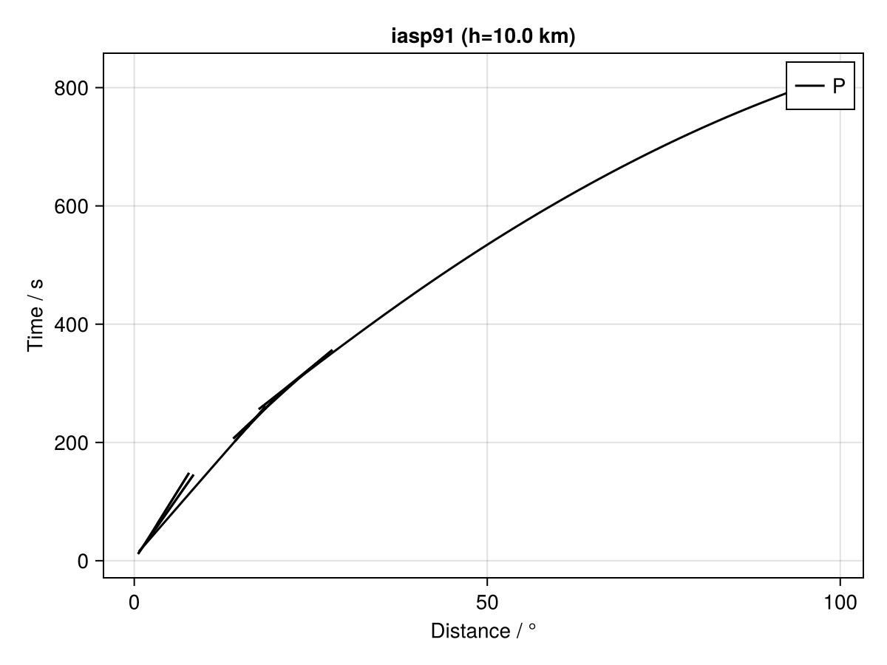
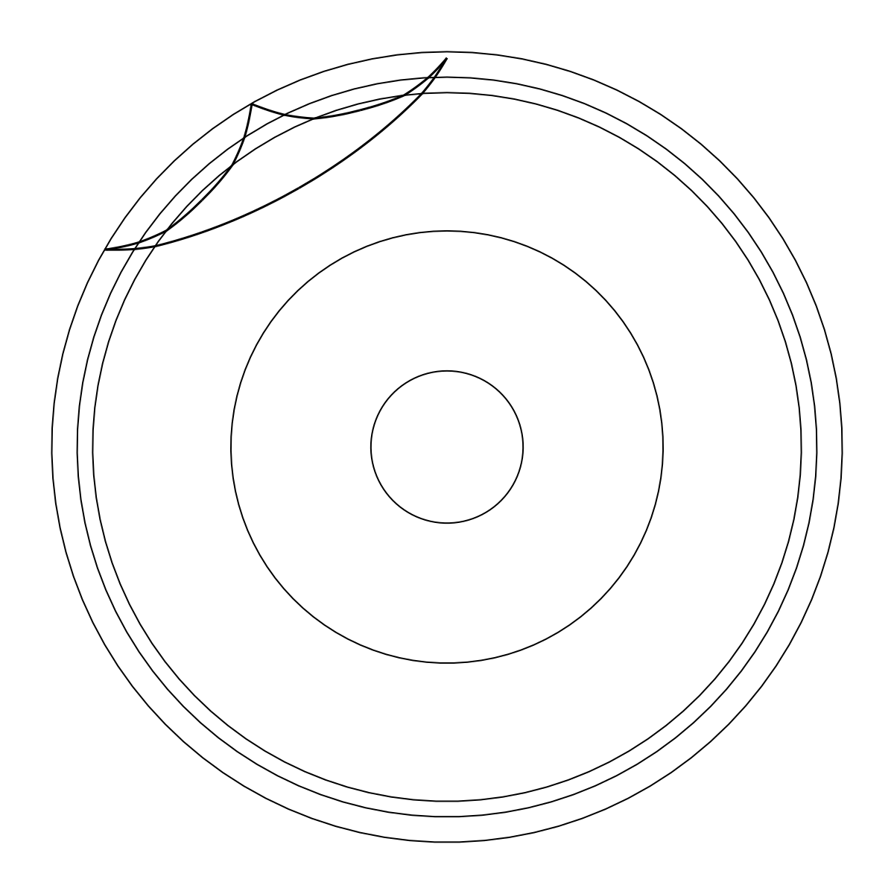
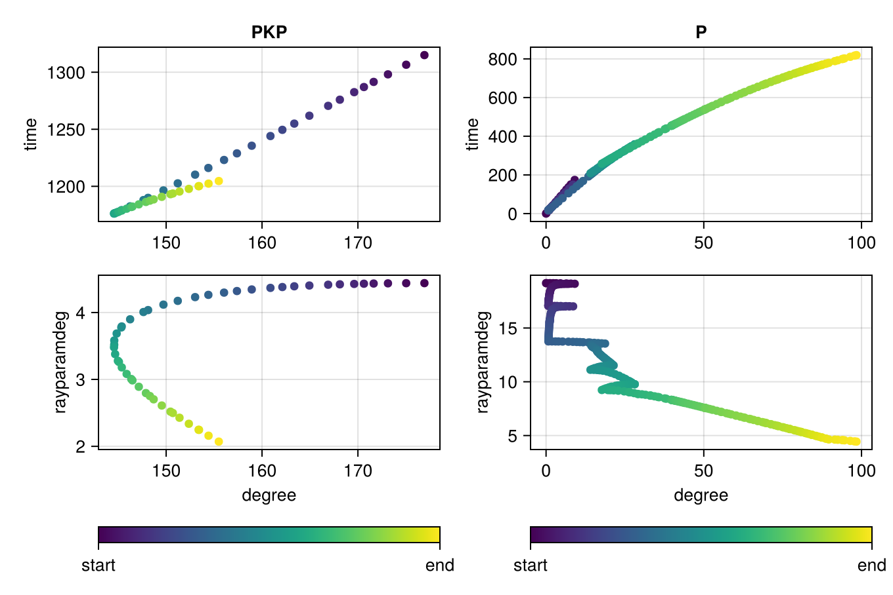
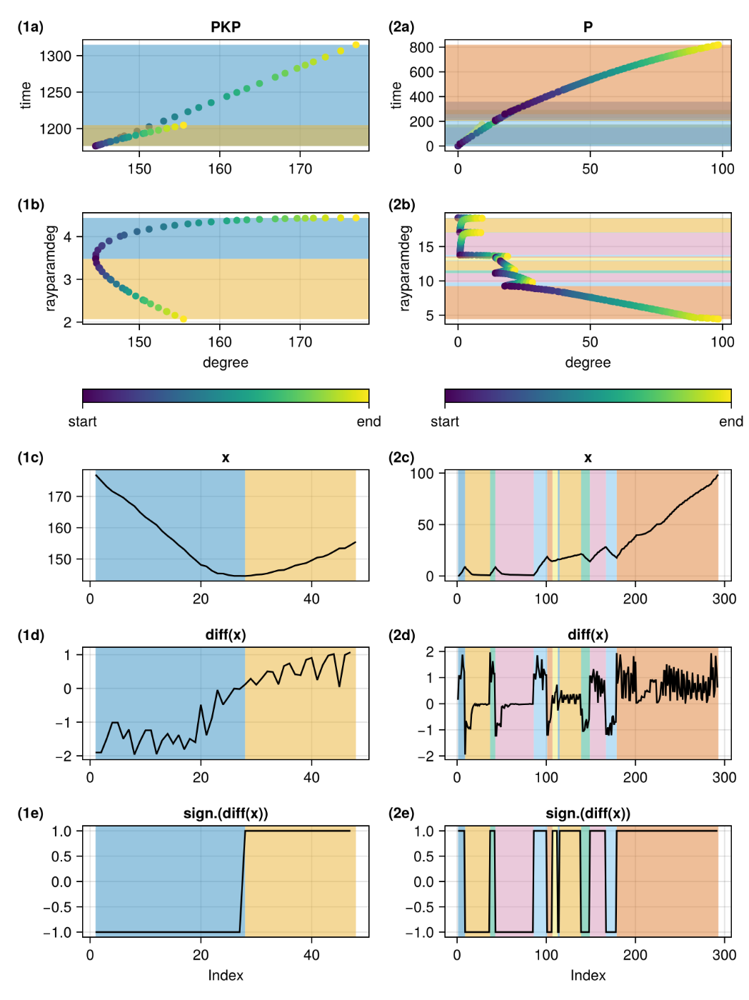

# TauPUtils.jl

🚧**Under Construction**

Julia utilities for computing and plotting seismic travel-time curves and ray
paths using the [TauP Toolkit](https://www.seis.sc.edu/taup/) (Crotwell et al., 1999) command-line interface.

See the [gallery](https://github.com/ytseis/TauPUtils.jl_Public/blob/main/examples/README.md#gallery) for examples of what you can do with TauPUtils.jl.

## Features

- Generate travel-time curves for one or more seismic phases.
- Parse TauP JSON output into Julia data types.
- Split triplicated curves into monotonic branches suitable for interpolation.
- Calculate phase differences over shared ray-parameter ranges.
- Plot travel-time curves and ray paths with CairoMakie.
- Use TauP's built-in or custom velocity models.

See [TauP documentation](https://taup.readthedocs.io/en/latest/) for more information on TauP's capabilities and supported phases.

## Requirements

- Julia 1.12
- TauP Toolkit, with the `taup`
  executable available on `PATH`
- Java as required by TauP

Confirm the external dependency before using the computation functions:

```sh
taup --version
```

Parsing previously generated JSON does not require the TauP executable.

## Installation

Until the package is registered, clone this repository and add it by path:

```julia
using Pkg
Pkg.develop(path="/path/to/TauPUtils.jl")
```

## Quick start

```julia
using TauPUtils

# A vector is returned because a phase can contain multiple monotonic branches.
curves = taup_curve("P"; model="iasp91", depth=10.0)
fig = plot_taup_curve(curves, color=:black)
```

<!--  -->
<p align="center">
  
</p>

Customize an existing CairoMakie axis:

```julia
using CairoMakie

fig = Figure()
ax = Axis(fig[1, 1]; xlabel="Distance / °", ylabel="Time / s")
plot_taup_curve!(ax, curves; color=:red, linewidth=2)
fig
```

Generate and plot ray paths:

```julia
path = taup_path(["P", "PP"]; model="ak135", depth=100, deg=60)
fig, ax, plot = plot_taup_path(path)
```

<p align="center">
  
</p>

The `PKPab` and `PKPbc` branches can also be requested directly with
`taup_curve("PKPab")` and `taup_curve("PKPbc")`.

See the [examples](examples/README.md) for multi-phase, depth, model, and axis
comparisons.

## How curve splitting works

TauP output does not explicitly identify every individual triplication branch.
TauPUtils detects changes in the sign of the independent-variable differences
and splits the result into monotonic segments.





## Development

Run the test suite with:

```sh
julia --project=. -e 'using Pkg; Pkg.test()'
```

The automated tests use committed JSON fixtures and do not require TauP.

## References

- Crotwell, H. P., T. J. Owens, and J. Ritsema (1999). The TauP Toolkit: Flexible seismic travel-time and ray-path utilities, Seismological Research Letters 70, 154–160, https://doi.org/10.1785/gssrl.70.2.154
- Crotwell, H. P. (2025). The TauP Toolkit (3.1.0). Zenodo. https://doi.org/10.5281/zenodo.16884103

## Other Julia interfaces to TauP include ...

- https://github.com/anowacki/TauPy.jl
- https://github.com/bvanderbeek/TauP.jl

## License

TauPUtils.jl is licensed under the MIT License.

TauPUtils.jl is an independent project and is not part of the TauP Toolkit. It interfaces with a separately installed TauP command-line executable; the TauP Toolkit itself is not distributed as part of this package.

The TauP Toolkit is distributed separately under the GNU Lesser General Public License v3.0 (LGPL-3.0). See the [TauP repository](https://github.com/crotwell/TauP) for its license terms.
