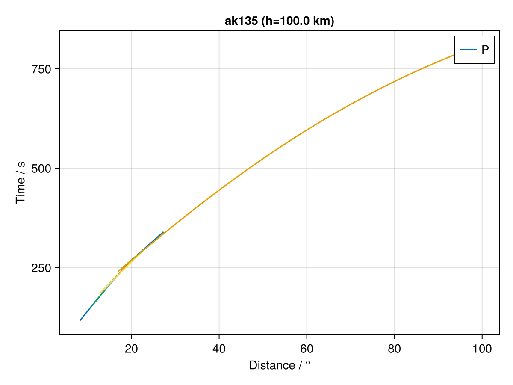
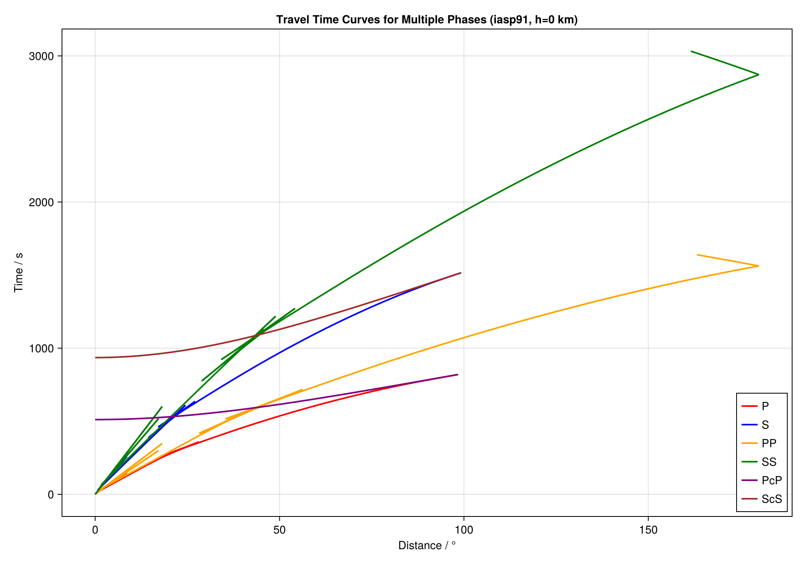
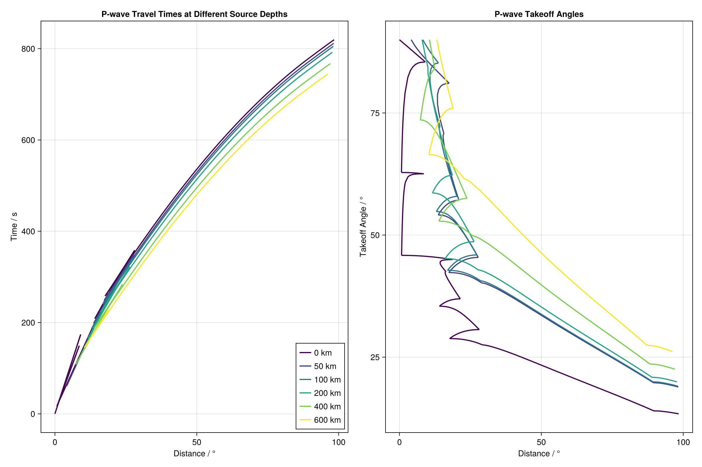
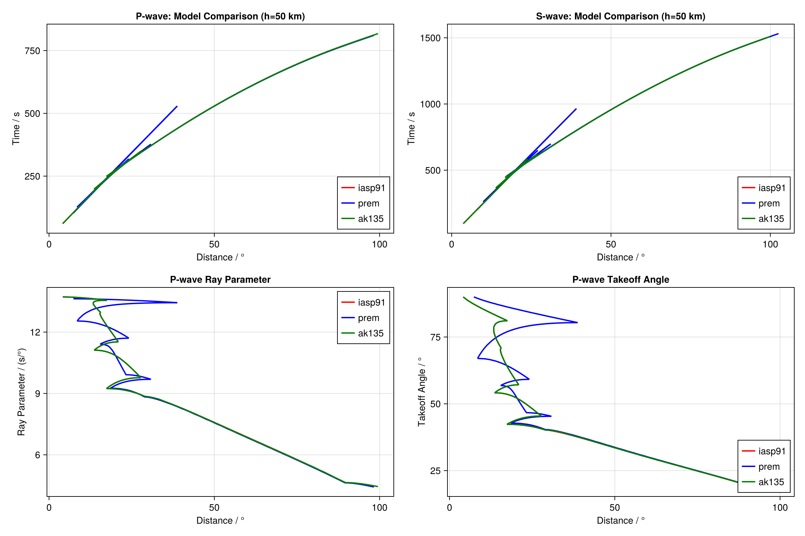
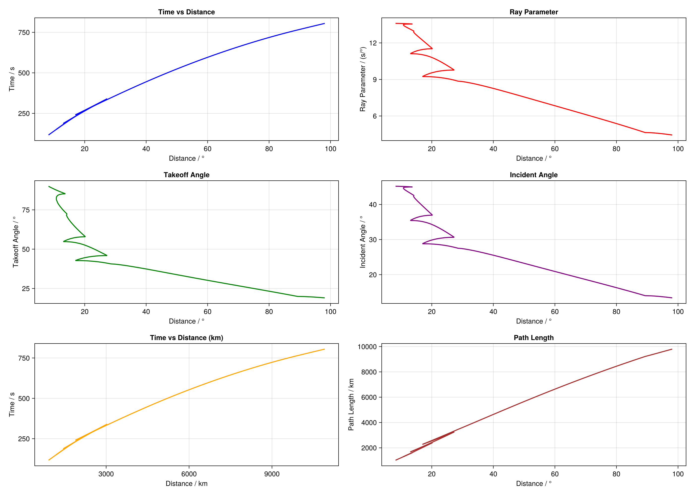

# TauPUtils.jl Examples

This directory contains examples demonstrating various features of TauPUtils.jl.

## Running Examples

To run any example:

```bash
cd examples
julia <example_file>.jl
```

## Available Examples

### 1. Basic Usage (`01_basic_usage.jl`)
- Generate a simple P-wave travel time curve
- Plot and save the curve
- Customize source depth and velocity model

### 2. Multiple Phases (`02_multiple_phases.jl`)
- Compare travel time curves for different seismic phases (P, S, PP, SS, PcP, ScS)
- Plot multiple phases on the same figure
- Customize colors and labels

### 3. Source Depth Comparison (`03_depth_comparison.jl`)
- Compare P-wave travel times at different source depths
- Plot takeoff angles for different depths
- Use colormaps for visualization

### 4. Velocity Model Comparison (`04_velocity_models.jl`)
- Compare travel times across different velocity models (iasp91, prem, ak135)
- Show differences in P-wave and S-wave arrivals
- Plot ray parameters and takeoff angles for model comparison

### 5. Advanced Axis Options (`05_advanced_axes.jl`)
- Demonstrate various axis types:
  - Time vs Distance
  - Ray Parameter
  - Takeoff Angle
  - Incident Angle
  - Path Length
  - Distance in kilometers

## Output

Each example generates PNG files in the current directory showing the results.

## Requirements

All examples require:
- TauPUtils.jl (this package)
- CairoMakie
- TauP toolkit installed and available in system PATH

## Notes

- Make sure TauP is properly installed before running examples
- Some examples may take a few seconds to generate multiple curves
- Generated PNG files can be used for presentations or publications


## Gallery

### Basic Usage

<p align="center">
  
  
</p>

### Multiple Phases



### Source Depth Comparison



### Velocity Model Comparison



### Advanced Axis Options


